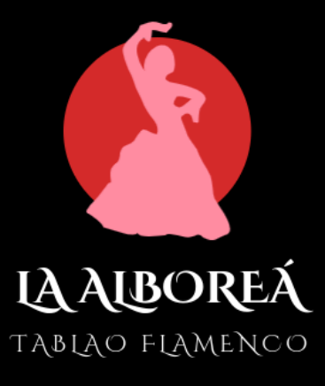
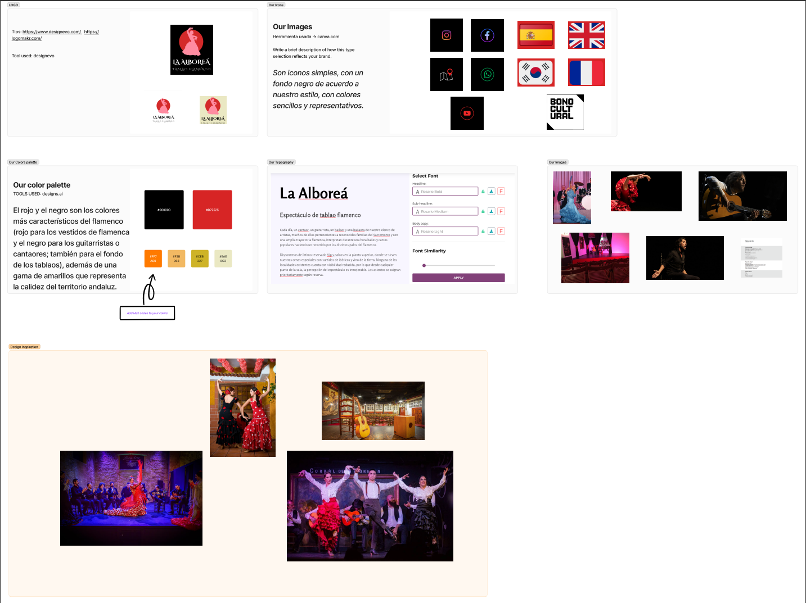
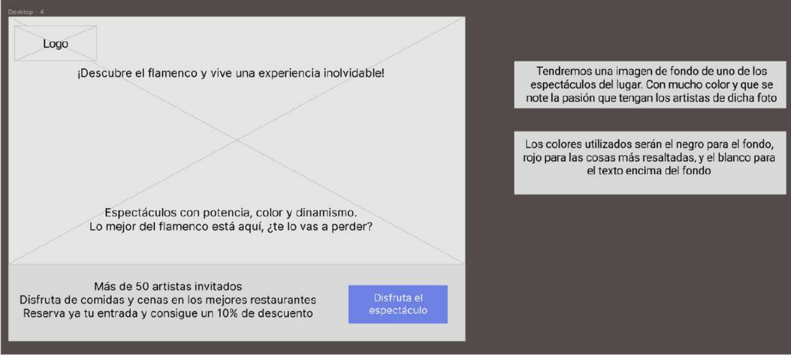
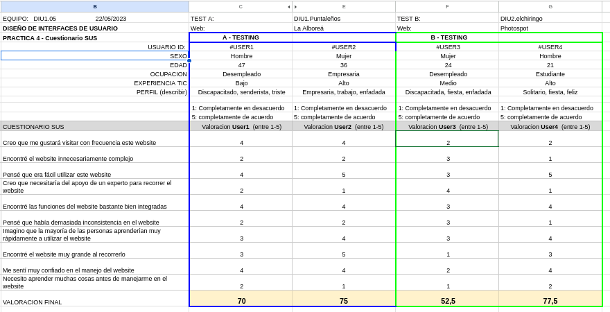

# DIU23
Prácticas Diseño Interfaces de Usuario 2022-23 (Tema: .... ) 

Grupo: DIU1_03_Puntaleños.  Curso: 2022/23 
Updated: 11/1/2023

Proyecto: 
Rediseño de la página web "La Alboreá" tablao flamenco

Descripción: 

Se pretende llevar a cabo un lavado de cara a la página web de tablao flamenco "La Alboreá" para así poder llegar a subir el número de visitas, de ventas  
y mostrar a más personas la afición por el flamenco. 

Logotipo:  

Miembros
 * :bust_in_silhouette:   FERNANDO MOLINA DELGADO     :octocat:     
 * :bust_in_silhouette:  JUAN MARCOS SÁNCHEZ DELGADO     :octocat:

----- 

# Proceso de Diseño 

## Paso 1. UX Desk Research & Analisis 

 1.a Competitive Analysis
-----

>>> En este análisis de competidores hemos seleccionado dos empresas más que
tienen una página web en internet y que se dedican a ofrecer espectáculos en
tablaos flamencos en Granada, para compararlas con la página web del tablao
flamenco que nos ocupa en esta práctica, <strong>La Alborea</strong>. 
  Como conclusiones, podemos decir que la página web de <strong>Jardines de Zoraya</strong> es notablemente inferior a las otras
dos en cuanto a visibilidad, dinamismo de la página y división de los distintos
aspectos del tablao flamenco. La siguiente página, correspondiente a <strong>Casa Ana</strong>, sí
contiene una mejor presentación, con mucha información acerca del mundo del
flamenco y un blog bastante representativo, pero, a su vez, muestra menos
movimiento y dinamismo que la página de <strong>La Alborea</strong>.   Por tanto, podríamos decir
que la página web que nos atañe en esta práctica tiene una mejor visibilidad que el
resto de las páginas analizadas. Presenta un mayor dinamismo que atrae al usuario,
haciendo más extensa su visita por la web, mucha información acerca del flamenco
y otras actividades en Granada, etc. Como único aspecto negativo podríamos
destacar la falta de imágenes propias del lugar, que conseguirían una mejor imagen
del tablao a los usuarios.

 1.b Persona
-----

>>> En este caso, hemos seleccionado dos personas totalmente distintas entre sí. En
primer lugar un hombre asturiano, <strong>Alfredo</strong>, de 29 años, dedicado a la guardia
forestal, divertido aunque algo introvertido, que tiene como objetivos en la vida vivir
de su trabajo, investigar especies animales, formar una familia y viajar lo máximo
posible. Lo hemos seleccionado porque el próximo verano viajará a Granada con
varios de sus amigos. Uno de ellos les ha recomendado ir al tablao flamenco La
Alborea porque ya ha estado en varias ocasiones y es fanático de estos eventos.
  La siguiente es <strong>Minerva</strong>, mujer de 43 años, divorciada, que sueña con ser una
escritora profesional y poder llegar a vivir de ello. Es de Albacete. Es un poco
introvertida, aunque si hay algo que quiera decir lo dice sin problema, le gusta
aprender con cada libro que lee y es muy innovadora. <strong>Minerva</strong> está apunto de viajar
a Granada para poder despejarse de su reciente ruptura y poder coger ideas para
su próxima novela. Escoge el tablao flamenco La Alborea, ya que le llama la
atención todos los servicios que ofrece y además, está muy cerca de su hotel y de la
Alhambra.  

 1.c User Journey Map
----

>>> En este Journey Map hemos escogido las historias de nuestros dos anteriores
protagonistas. En resumen, Alfredo compra la entrada al tablao flamenco ya que sus
amigos le han ofrecido asistir, pero no sin antes, ir revisando la información que
ofrece el sitio, visitando la página web. Aquí va viendo los días que hay disponibles
para ir y su precio. No le agrada mucho que sea tan caro, pero al ir con sus amigos,
se siente un poco presionado. Finalmente, se acaba convenciendo a sí mismo de
que es algo nuevo y debería experimentar, por lo que finalmente paga la entrada y
avisa a sus amigos.
  En cambio, Minerva, planeando bastante poco su viaje a Granada, decide buscar
algo relacionado con el flamenco en dicha ciudad, para empaparse un poco más de
la cultura de la misma, además de que le encanta. Ya ha reservado un hotel
previamente bastante cerca de la Alhambra ya que tiene decidido ir a visitarla, es el
monumento más representativo de Granada, por lo que busca el show cerca del
mismo. Entre varias alternativas que ofrece Google, se encuentra La Alborea.
Visitando la página web, además de ofrecer un show flamenco, tienen servicio de
comida y de guías turísticas, esto le viene perfecto a Minerva ya que así puede
aprender un poco más de Granada. Pide la entrada, que era su principal motivo.  

 1.d Usability Review
----
>>> - Enlace al documento:  [hoja de cálculo](https://github.com/Fernanps2/Puntalenios/blob/master/P1/UsabilityReview_DIU1_05.xlsx)
>>> - Valoración final (numérica): 86 - GOOD
>>> - Comentario sobre la valoración:  Destaca mucho en la mayoría de las características, ya que lo hace
bastante bien, y todo lo que es representar a la página, lo llevan perfectamente.
Cierto es, que hay herramientas que no implementan, como sería una barra de
búsqueda, por ejemplo, para encontrar a un artista en concreto o para encontrar
algún show en específico.  
Tiene una interfaz preciosa, combinando los colores más característicos del
flamenco, como viene a ser el negro, el rojo y un poco de blanco, aunque predomina
bastante el color negro. Tiene un bonito vídeo de presentación al abrir la página por
primera vez, donde, a fin de cuentas, te muestran la experiencia que se puede tener
dentro de este lugar. La página de inicio está clara y no satura de información,
aunque te puedes encontrar fotos puestas unas encima de otras que, en vista del
usuario, resulta poco agradable a la vista y, además, la tipografía no es la más
elegante para este tipo de página. Los subtítulos, que tiene la página de inicio, están
en minúscula, algo resaltante y poco agradable a la vista.  
Las categorías del menú están bastante claras, por lo que es sencillo poder
encontrar la ubicación del sitio, comprar las entradas, ver la carta de degustación,
ver los días disponibles y las experiencias que ofrecen. Por otro lado, está bastante
escondido el mensaje de contacto, ya que está en “ubicación”, pero lo alivian con
un botón bastante grande, fácil de ver, para entrar en un grupo de whatsapp y poder
hablar con ellos.  
En conclusión, es una página bastante adecuada para representar su negocio y
atraer a la gente fanática de esta categoría.

## Paso 2. UX Design  

 2.a Feedback Capture Grid / EMpathy map / POV
----

  
    
Nuestra “propuesta de valor” es dar toda la información posible al usuario y,
además, hacer lo más cómodo el uso que le dé a la página web. Ejemplos de lo
anteriormente dicho sería el poder reservar plaza en el restaurante sin necesidad de
tener que llamar a los del restaurante directamente o, también, poder reservar un
sitio conjunto en el espectáculo para poder estar en un lugar más deseado y
rodeado de sus acompañantes.  
Por otro lado, está el tema de la información, ya que no daban la suficiente
información visual para hacerse una idea de cómo es el espectáculo antes de ir, o
sobre los propios artistas invitados, ya que no se tiene constancia de sus referencias
o de lo que han hecho en su carrera profesional.  
Por ello, vemos importantes estos dos aspectos de cara a informar y acomodar al
usuario.

 2.b ScopeCanvas
----

Apostamos por “facilitar” al usuario poder reservar entrada con un sitio asegurado,
además de poder llegar a reservar en el restaurante sin necesidad de tener que
estar en contacto con el mismo restaurante. Poder cancelar su reserva si al final no
puede venir. Poder ver quiénes son los artistas que van, para así poder “facilitar” al
usuario previsualizar su experiencia en el espectáculo. Por último, mostrar imágenes
y vídeos del lugar, mostrando así nuestro espectacular establecimiento y todo lo que
ofrecen nuestras instalaciones.  
Por otra parte, nuestro objetivo es llegar a todos los públicos, pero sobre todo a los
jóvenes. Y, además, fomentar la cultura flamenca.

 2.b Tasks analysis 
-----

En este apartado hemos identificado una lista de tareas a realizar por los usuarios
en la página web. Como usuarios, hemos distinguido entre personas nacionales,
refiriéndonos a habitantes de la provincia de Granada, y personas extranjeras,
incluyéndose aquí tanto personas del resto de España como personas de otros
países. Como tareas, hemos identificado aquellas más relevantes que realizan los
usuarios al interactuar con la página web, destacando especialmente (sombreadas
en color gris) tareas tales como reservar entrada en el establecimiento, visitar la
sección de los autores, reservar una mesa en el restaurante o ver reseñas del lugar.  
Estas son las tareas que hemos considerado más importantes, ya que con nuestra
propuesta de valor queremos resaltar este tipo de acciones en la página web, así
como reservar una entrada para el evento que puede ser una de las acciones
principales y más importantes de los usuarios.

 2.c IA: Sitemap + Labelling 
----

Término | Significado     
| ------------- | -------
  la alboreá |Esta etiqueta indica la página de inicio de la web, un breve resumen de lo que ofrece.
reservar | Lleva a la página específica para reservar las entradas para el evento.
experiencias | Lleva a la página que contiene servicios externos disponibles, como son las guías turísticas o clases de flamenco.
información | Muestra información acerca de la agenda del sitio y un blog de flamenco.
contáctanos | Página donde se muestra el mapa donde se ubica el sitio y un pequeño formulario para contactar con el sitio.
espectáculo | Página donde se muestra información sobre el lugar y los espectáculos.
artistas | Muestra enlaces a los diferentes tipos de artistas que hay.
artistas de cante | Lleva a la información acerca de los distintos artistas de cante.
artistas de guitarra | Lleva a la información acerca de los distintos artistas de guitarra.
artistas de baile | Lleva a la información acerca de los distintos artistas de baile.
guías | Página donde se muestran las guías turísticas de Granada.
clases | Página donde se muestran las clases de flamenco que se ofertan.
talleres | Página donde se muestran talleres sobre la cultura de Granada y su historia.
cenas | Página donde se muestra el menú del restaurante e información sobre el mismo.
agenda | Muestra documentos correspondientes a cada mes con los artistas que acudirán en cada día que se celebre un espectáculo.
blog | Lleva a un blog de flamenco donde se muestran las principales noticias del sitio.
ubicación | Muestra un mapa con la ubicación del lugar junto con un enlace a google maps.
contacto | Formulario para poder contactar con los responsables del lugar

 2.d Wireframes
-----

>>> - Enlace a los bocetos:  [bocetos en figma](https://github.com/Fernanps2/Puntalenios/blob/master/P2/Bocetos.fig)

En este paso hemos desarrollado los bocetos de las distintas pantallas de la interfaz gráfica
que el usuario puede ver cuando visita la página web, destacando aquellos cambios o
mejoras que hemos ido comentando a lo largo de la práctica tales como la posibilidad de
reservar en el restaurante a la hora de reservar la entrada, elegir los asientos, etc. Todos
estos bocetos se adjuntan a la entrega de esta práctica.
Para identificar los distintos bocetos que se han desarrollado y su organización simplemente
debemos fijarnos en el Sitemap, donde cada boceto está relacionado con cada una de las
interfaces que se extienden en dicho esquema.  
En estos bocetos hemos tenido en cuenta los siguientes detalles de acuerdo con nuestra
propuesta de valor desarrollada en esta práctica: se ha añadido más información gráfica
acerca del tablao flamenco, añadiendo más fotografías y vídeos de los eventos celebrados,
incluyendo un apartado de galería donde poder ver toda esta información; se ha añadido
más información y referencias acerca de los artistas de este tablao flamenco, diferenciando
entre artistas de baile, de cante o de guitarra; se añade la posibilidad de reservar los
asientos concretos donde se situarán los usuarios en el interior del recinto; se añade la
posibilidad de reservar una mesa en el restaurante desde la página de reserva de entradas
sin necesidad de contactar directamente con el restaurante.

## Paso 3. Mi UX-Case Study (diseño)

 3.a Moodboard
-----

Para realizar este apartado hemos usado la plantilla de Moodboard proporcionada
en Figma. En ella hemos incluido varios logotipos, una fuente a usar, la paleta de
colores que representa nuestra página, los iconos que se usan, las imagenes que
se utilizan en la web y una serie de imagenes inspiradoras. 
Para los logotipos hemos utilizado la herramienta Designevo. Se ha incluido un
logotipo principal, que es el que aparece en mayor tamaño y también aparecen
otros dos logotipos secundarios que han sido objeto de prueba en nuestra página
web para comprobar su usabilidad. 
Los iconos que usaremos son los necesarios para indicar las redes sociales del
sitio, la ubicación, los idiomas en que está disponible la página web, así como el
bono cultural. Los iconos de redes sociales tienen un fondo negro, adecuandose así
al color principal de fondo de nuestra página web. 
La paleta de colores usada destaca los colores negro y rojo, que serán los colores
principales de la página, negro para el fondo y en rojo para los contenidos más
destacables. Además, se usan otros colores para distintas partes de la web como el
amarillo para la zona de comentarios, el blanco para el texto, etc.
En cuanto a la tipografía, hemos usado la fuente de tipo Rosario, un tipo de letra
claro, sencillo y bonito. 
Por último, se han incluido las imágenes que se han usado en la portada de la
página web y una serie de imagenes inspiradoras en las que los colores, las formas,
los fondos, etc, han servido de inspiración para nuestro diseño.

  3.b Landing Page
----

En este paso hemos diseñado la página web Onboarding de nuestro proyecto. Esta
página incluye un título y un subtitulo, un logotipo, elementos gráficos de refuerzo,
detalle de las características de beneficios de nuestra propuesta y una única accion
CTA que redirige a la app. 
En el título hemos optado por una frase que resalte nuestra propuesta de valor, que
llame la atención del usuario, un usuario que no conozca el flamenco o tenga poca
información. Además hemos resaltado esta propuesta con el subtitulo en el que
resalta el potencial de nuestra web. 
El titulo y el subtítulo se encuentran sobre una imagen de fondo, que caracterizará
nuestra página y la hará más llamativa para los usuarios, conteniendo mucho color
y sobresaltando la pasión de los artistas. 
También se han definido 3 propuestas de valor con el objetivo de llamar la atención
de los usuarios, que se adentren en la página web y se consigan mas visitas.
Por último, se ha incluido un botón de acceso a la página web, con un mensaje
claro que incite al usuario a entrar en la página. 
Los colores utilizados serán el negro para el fondo, rojo para las cosas más
resaltadas, y el blanco para el texto encima del fondo. 

 3.c Guidelines
----

Para los guidelines hemos considerado aquellas partes de la página web tales como
menús, iconos seleccionables, botones, etc. Así, la primera parte muestra los iconos
con los que se seleccionan los asientos disponibles en el tablao y posteriomente las
distintas partes de los menús desplegables que aparecen en la parte superior de la
página web. Después tenemos el menú donde seleccionamos los asientos y donde
podemos incluir los aperitivos, el numero de participantes y la hora del evento. Para
una mayor claridad se adjunta a la entrega un video donde se muestran los distintos
guidelines. 
Para los patrones de diseño, en primer lugar, para la página de reserva hemos
usado un patrón de diseño relacionado con una tarea ya que, se debe realizar en
esta página la reserva de una entrada para asistir al tablao flamenco. Así, tenemos
al principio una imagen y una pequeña descripción del espectáculo y despues se
descompone la tarea de reserva por pasos: primero se seleccionan los participantes
y la fecha, se eligen los asientos y se confirma la seleccion de aperitivos y por último
se selecciona si se desea reservar en el restaurante. 
Usamos también el patrón combinado en el que destacamos el contenido relevante
y facilitamos el uso de la navegación. En nuestras páginas elegidas para el mockup
destacamos el contenido importante en, por ejemplo, los botones de reservar
entradas, botones para ver eventos, para obtener más información, los comentarios
de los clientes en un color destacado, la información de los artistas es breve,
concisa y clara, mejorando la atracción del usuario, etc. En cuanto al patrón de
navegación, tenemos una división clara de los distintos elementos a los que se
puede acceder en la página desde el menú superior, tenemos páginas con botones
que contienen enlaces para llegar a otras páginas como por ejemplo el botón que te
lleva a reservar en la página inicial, tenemos menús apilados en el menú superior,
etc. 
Queda pendiente usar el patrón de diseño que organiza la información como una
lista de elementos en la página en la que se muestran los distintos tipos de artistas
según el tipo seleccionado, que en esta práctica no se ha seleccionado para el
mockup. 

>>> - Guidelines usados: [guidelines](https://github.com/Fernanps2/Puntalenios/blob/master/P3/GuideLines.pdf)

  3.d Mockup
----

Como ya hemos ido desarrollando a lo largo de este documento, hemos
desarrollado 3 páginas distintas de nuestra web a las que hemos aplicado los
patrones de diseño y las propuestas de valor comentadas. 
Todas las páginas disponen de un menú superior en el que podemos ver las
distintas páginas disponibles mediante menús desplegables y el logo que
realizamos en el moodboard. La página principal contiene una pequeña y concisa
descripción acerca del tablao, los servicios que se ofrecen, comentarios de otros
usuarios que ya han asistido al tablao, un apartado de contenido destacado de la
semana, enlace a los eventos que hay programados en el mes y un pie de página,
además de los distintos botones para llegar a otras páginas del sitio. 
La página de los artistas muestra una división entre cantaores, bailaores y
guitarristas con una pequeña descripción de ellos. Se podrá seleccionar uno de
estos tipos y se llevará a la página que contiene todos los artistas de ese tipo donde
podremos ver la información detallada de cada uno de ellos. 
Por último, la página de reserva ya ha sido descrita anteriormente en el apartado de
los patrones de diseño. Como resúmen, tenemos una imagen del tablao, una
pequeña descripción y a continuación podremos seleccionar todas las opciones que
queremos que tenga nuestra reserva. Al final, se resalta el botón de finalizar la
reserva con un color rojo. 
En todas las páginas disponemos de un pie de página donde también se muestran
enlaces que llevan a distintas páginas del sitio, información sobre el la ubicación del
sitio, teléfono y contacto, información sobre el uso del bono cultural y se muestran
también los iconos que mencionábamos en el moodboard para dirigir al usuario las
redes sociales del tablao flamenco. 

El pdf del Mockup al ser exportado desde FIGMA usa un tipo de pdf especial, y en github no puede previsualizarlo
coorectamente. Pero si se descarga se puede ver perfectamente. 

>>> - Muestra de las páginas creadas: [mockup](https://github.com/Fernanps2/Puntalenios/blob/master/P3/MockupPDFPLUS.pdf)
>>> - Vídeo con la prueba de las páginas: [vídeo](https://github.com/Fernanps2/Puntalenios/blob/master/P3/video%20prueba%20mockup.mkv)

<!--  3.e ¿My UX-Case Study?
-----

>>> Publicar my Case Study en Github..
>>> Documente y resuma el diseño de su producto en forma de video de 90 segundos aprox -->

## Paso 4. Evaluación 

 4.a Caso asignado
----

**Caso asignado:** [PhotoSpot](https://github.com/jepalfer/DIU-chiringo/tree/master/P3)

Con “Photospot” descubrirás lugares increíbles y únicos para tus fotos para redes sociales. Es una aplicación caracterizada por su comodidad y libre albedrío para explorar tú mismo y conocer los lugares más bonitos y un poco de la historia que hay detrás de cada lugar.
La aplicación diseñada destaca por lo minimalista que es, presentándose con colores como el blanco y el negro, dando un aire de seriedad y profesionalismo. Al acceder a la app nos dan varias opciones de navegabilidad, siendo estas: ir a la página de noticias, informarse sobre los propietarios, el ingreso y formulario de contacto.

 4.b User Testing
----

**CASO A:** Tablao flamenco (Alboreá)
**CASO B:** Aplicación sobre fotografías y viajes (PhotoSpot)

| Usuarios | Sexo/Edad     | Ocupación   |  Exp.TIC    | Personalidad | Plataforma | TestA/B
| ------------- | -------- | ----------- | ----------- | -----------  | ---------- | ----
| User1  | H / 47   | Desempleado  | Baja       | Triste | Móvil       | A 
| User2  | M / 36   | Empresario  | Alta       | Enfadado       | Mac        | A 
| User3  | M / 24   | Desempleado     | Media        | Enfadado    | Móvil      | B 
| User4  | H / 21   | Estudiante  | Alta       | Feliz     |Windows       | B 

. 4.c Cuestionario SUS
----

  
Para el caso B partimos de dos usuarios ficticios creados con Role Play. El primero de ellos es una mujer de 24 años que es discapacitada, desempleada, con un nivel medio de experiencia en TICs y cuya acción es bailar y su emoción es enfadada. Hemos obtenido una valoración final de 40 puntos sobre 100, con lo cual, podemos concluir que se encuentra en el tipo marginal (40-60). Es una puntuación baja que puede deberse a que la página no se ha adaptado muy bien al tipo de usuario que la visitaba, debido a que quizás es una página dinámica que requiere cambiar de pantalla constantemente y que está dirigida a usuarios concretos que usen la página a menudo.
  
El segundo usuario se trata de un hombre de 21 años que es estudiante, con un uso alto de TICs y cuyo perfil es solitario, la acción que lo describe es bailar y su emoción es feliz. Con este usuario hemos obtenido una valoración final de 77.5 puntos sobre 100, con lo cual, tenemos una valoración aceptable tipo B (entre 70 y 80). Al tratarse de una persona joven, con uso habitual de TICs, obtenemos una valoración más alta ya que es un usuario que podría ser típico de este sitio web, adaptándose bien y sin demasiados problemas a la web.

 4.d Usability Report
----

[Informe de usabilidad] (https://github.com/Fernanps2/Puntalenios/blob/master/P4/UsabilityReportPhotospot.pdf)
  
En conclusión, podemos determinar que esta página cuenta con una interfaz sencilla y bastante minimalista, que aún destacando en sencillez, falla en la falta de información, por ejemplo, en la página de inicio aparecen tres botones en la parte inferior que no se especifica para qué son o a dónde te llevan.
  
Los datos proporcionados por la web son claros y fáciles de leer, ya que usa letra  considerablemente grande para no dificultar su lectura, pero el uso del estilo de letra “italic” para destacar secciones en el texto, hace que no cumpla su función de “destacar” ya que se pierde con todo el texto.
  
Los colores usados son demasiado planos (blanco y negro) destacando únicamente la sección de “amigos”, “recompensas” y “colecciones”, pero no acaban de fusionarse del todo bien.
  
Por último, esta aplicación está destinada a captar un público muy específico: gente que le guste viajar, que salga bastante de casa, que se mueva mucho… Ya que gente “normal”, no podría competir con personas que tengan más dinero y tiempo para viajar por el mundo y hacer fotos.

>>> ## Paso 5. Evaluación de Accesibilidad  (no necesaria)

>>>   5.a Accesibility evaluation Report 
>>>> ----

>>> Indica qué pretendes evaluar (de accesibilidad) sobre qué APP y qué resultados has obtenido 

>>> 5.a) Evaluación de la Accesibilidad (con simuladores o verificación de WACG) 
>>> 5.b) Uso de simuladores de accesibilidad 

>>> (uso de tabla de datos, indicar herramientas usadas) 

>>> 5.c Breve resumen del estudio de accesibilidad (de práctica 1) y puntos fuertes y de mejora de los criterios de accesibilidad de tu diseño propuesto en Práctica 4.

## Conclusión final / Valoración de las prácticas

>>> (90-150 palabras) Opinión del proceso de desarrollo de diseño siguiendo metodología UX y valoración (positiva /negativa) de los resultados obtenidos  

